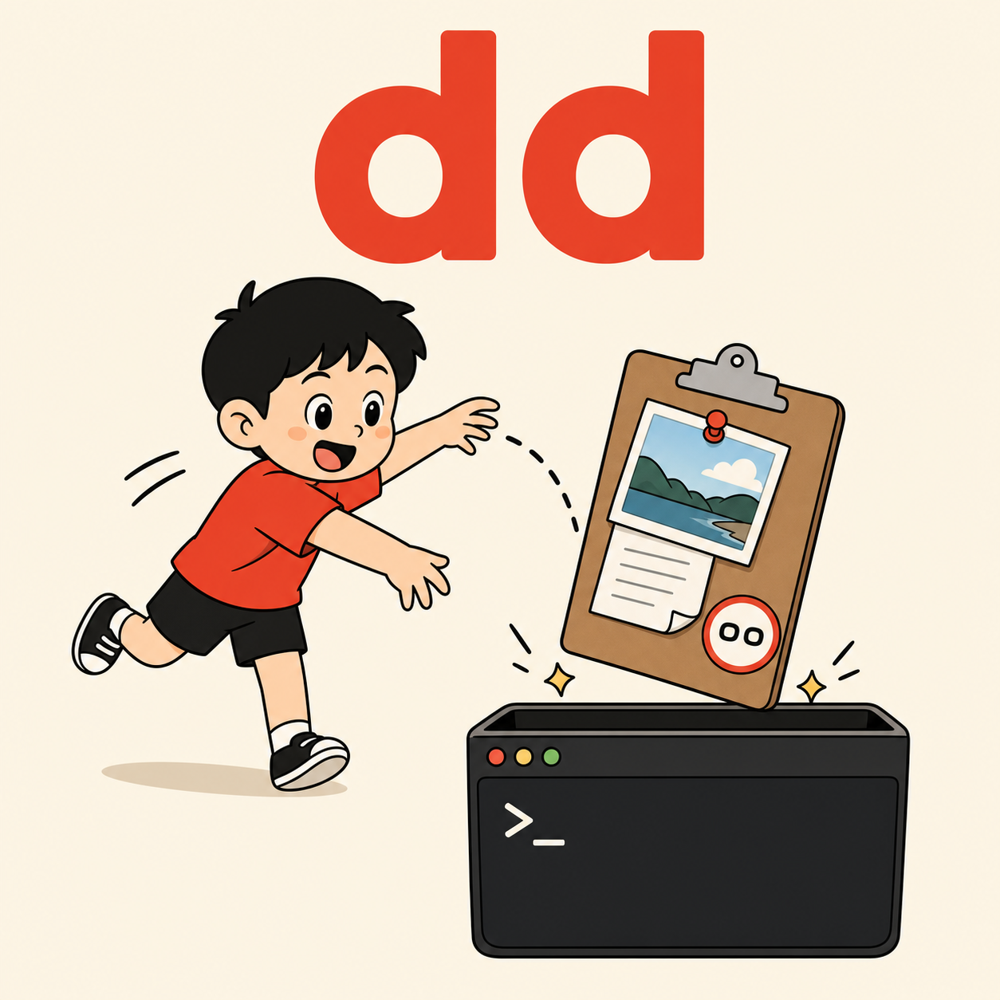

[English](README.md) | [한국어](README.ko.md) | [中文](README.zh.md) | 日本語 | [Español](README.es.md)

# dd

<p align="center">
  
</p>

> 長いログやスクリーンショットを、チャットに貼り付けずに Claude Code へ渡す。

Claude Code での作業中、貼り付けは絶えず発生します。何かが壊れたらエラーログ、何かを作るならリファレンス、欲しい画面はスクリーンショットで見せる。`dd` はそれをクリップボードから直接読み取ってローカルファイルに保管し、会話には必要な情報だけを渡します——大きな素材はバックグラウンドで分析して、結論だけを持ち帰ることもあります。

[クイックスタート](#クイックスタート) • [なぜ dd なのか](#なぜ-dd-なのか) • [仕組み](#仕組み) • [主な機能](#主な機能) • [コマンド](#コマンド) • [動作要件](#動作要件)

---

## クイックスタート

### 1. マーケットプレイスを追加

```
/plugin marketplace add https://github.com/fivetaku/gptaku_plugins.git
```

### 2. インストール

```
/plugin install dd
```

### 3. Claude Code を再起動

（新しいコマンドは再起動後に登録されます。）

### 4. 使ってみる

クリップボードに何かを載せてから、`/dd`（または `/ㅇㅇ`）に要望を添えて入力するだけ——貼り付けは不要です：

- **画像 — Windows:** `Win`+`Shift`+`S` でキャプチャ → `/dd なぜこう表示されるの？`（キャプチャはすでにクリップボードにあります）
- **画像 — macOS:** `Shift`+`Cmd`+`4` でキャプチャ → `/dd このリファレンスみたいに作って`（初回のみ、スクリーンショットがクリップボードに保存されるよう設定 — スクリーンショットツールバー `Shift`+`Cmd`+`5` → **オプション** → **保存先: クリップボード**）
- **長文テキスト / エラーログ:** コピー → `/dd これ何のエラー？` — テキストの壁がチャットに入らないので、セッションは軽いまま
- **要望なし:** ただ `/dd` — クリップボードを読み、会話の流れから続けます

韓国語 IME のままでも `/dd` をそのまま打てば `/ㅇㅇ` になり、同じように動きます。言語切り替えは不要です。

---

## なぜ dd なのか

Claude Code で作業していると、貼り付ける場面が次々に出てきます。壊れたときのエラーログ、作るときのリファレンス、欲しい見た目を示すスクリーンショット。これを全部チャットに直接貼ると、2 つの問題にぶつかります。

長いテキストは会話を食いつぶします。大きなログを一度貼ればずっと残って場所を取り、ターンのたびに読み直されて、セッションはじわじわ遅く、高くなっていきます。`dd` は全文をファイルに置き、Claude には短い要約だけを渡し、タスクが必要とするときだけ追加で読みます。

画像はそもそも貼り付けられないことがあります。環境によっては、Claude Code が貼り付けた画像を受け取れません。`dd` はクリップボードを直接読むので、キャプチャして `/dd` と打つだけ。コピーした画像ファイルも、アイコンではなく実際の絵として届きます。

「さっきコピーしたエラー」や「上のリファレンス」と繰り返す必要もなくなります。そして `dd` が違うものを掴んだ場合は（クリップボードにはタイムスタンプがないので）、掴んだ内容を見せて先に確認します。

`dd` という名前に意味はありません。頻繁に使うのに毎回長く打つのは面倒なので、素早く 2 回叩ける 2 文字にしただけです。（韓国語 IME では同じキーが `ㅇㅇ` になりますが、それも同じように動きます。）

---

## 仕組み

```
コピー / スクリーンショット
   → /dd [要望]
   → dd_clipboard.py が現在のクリップボードを ~/dd/<日付>/<id>/ にキャプチャ
       · テキスト → content.txt   画像 → image.png   + manifest.json
   → Claude は manifest の要約だけを読む（全文は読まない）
   → 掴んだものを表示。違和感があれば確認し、問題なければ作業へ
```

OS のクリップボードは直近のコピー 1 件だけを保持します（履歴なし）。`dd` は常にその現在の項目をキャプチャし、プレビューでは機密情報をマスクし、7 日を過ぎたキャプチャを自動で片付けます。

---

## 主な機能

| 機能 | 説明 |
|------|------|
| テキスト・画像キャプチャ | macOS / Windows / WSL / Linux のクリップボード、テキストまたは画像 |
| instruction パターン注入 | 毎回の `/dd` で `${CLAUDE_PLUGIN_ROOT}` 経由でキャプチャ — 誰でも動く |
| 確認ゲート | クリップボードが要望と無関係・曖昧なときだけ、作業前に確認 |
| 遅延読み込み | `size_class` に応じて読むので、巨大な貼り付けがコンテキストを溢れさせない |
| 機密情報マスキング | `api_key`、`Bearer`、`sk-`、`ghp_`、`xoxb-` などをプレビューでマスク |
| 自動クリーンアップ | `DD_RETENTION_DAYS`（既定 7 日）を過ぎたキャプチャを実行のたびに削除 |
| バックグラウンド分析 | 大きなログや画像はサブエージェントで分析し、結果だけを会話に入れる |
| あなたの言語で返答 | 要望の言語で答え、要望がなければ会話の言語で |

---

## コマンド

| コマンド | 説明 |
|----------|------|
| `/dd [要望]` | 現在のクリップボードをキャプチャして作業 |
| `/ㅇㅇ [要望]` | `/dd` と同じ（ハングル入力時のエイリアス） |

### 自然言語トリガー

- "방금 캡처한 거 분석해줘", "이 레퍼런스로 만들어줘", "스크린샷 드롭"
- "drop clipboard", "use what I copied", "this screenshot"

---

## 動作要件

- [Claude Code](https://docs.anthropic.com/claude-code) CLI
- Python 3（標準ライブラリのみ）
- **macOS**: そのまま動作（`pbpaste` / `osascript`）
- **Windows / WSL**: PowerShell（標準搭載）— ユーザー検証済み
- **Linux**: クリップボードツール（`xclip` / `wl-clipboard`）のインストールと GUI セッションが必要

---

## ライセンス

MIT

---

<div align="center">

何かをコピーして、`/dd`。

</div>
